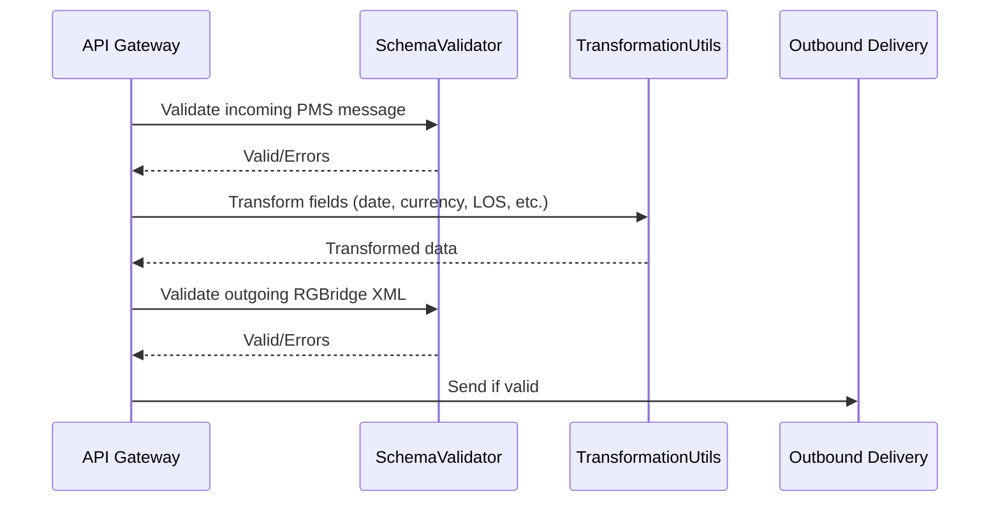

# Technical Design Document: Validation & Transformation Utilities

## 1. Purpose & Responsibilities
- Validate incoming PMS messages against their schemas (JSON Schema, XSD, GraphQL SDL, WSDL).
- Validate outgoing RGBridge messages against the RGBridge XSD/schema.
- Provide utility functions for common data transformations (date, currency, LOS pattern, flags, etc.).
- Ensure data integrity and compliance before translation and outbound delivery.

## 2. Key Classes, Modules, or Services
- `SchemaValidator` (validates incoming and outgoing messages)
- `TransformationUtils` (utility functions for data conversion)
- `ErrorCollector` (aggregates and reports validation errors)
- `AdvancedPatternParser` (parses LOS patterns, flags, etc.)

## 3. Interfaces & APIs
- **Validation Functions:**
  - `validate_incoming(payload, schema_type, schema) -> bool, errors`
  - `validate_outgoing(rgbridge_xml, xsd) -> bool, errors`
- **Transformation Utilities:**
  - `parse_date(date_str) -> datetime`
  - `convert_currency(amount, from_code, to_code) -> float`
  - `parse_los_pattern(pattern_str) -> dict`
  - `normalize_flag(flag_value) -> bool`

## 4. Data Flow & Interactions
1. API Gateway receives a PMS message and invokes `SchemaValidator` for incoming validation.
2. If valid, the message is passed to the translator and transformation utilities are used as needed.
3. The resulting RGBridge message is validated against the RGBridge XSD before outbound delivery.
4. Any validation or transformation errors are collected and reported.



## 5. Extensibility & Configuration
- Support for new schema types (e.g., new XML or JSON standards) via pluggable validators.
- Utility functions can be extended for new data types or transformation rules.
- Validation rules and error reporting can be configured via settings.

## 6. Security & Compliance
- All validation and transformation steps are logged for auditability.
- Sensitive data is masked in error logs.
- Ensures only valid, compliant data is processed and sent outbound.
- Complies with GDPR/PCI for data handling and retention.

## 7. Dependencies & Libraries
- `pydantic` (JSON validation)
- `xmlschema` (XML/XSD validation)
- `graphql-core` (GraphQL validation)
- `python-dateutil` (date parsing)
- `forex-python` or similar (currency conversion)

## 8. Error Handling & Monitoring
- All validation and transformation errors are collected and reported to the API Gateway.
- Errors are logged with context for debugging and audit.
- Monitoring can alert on repeated or critical validation failures.

## 9. Example Code or Pseudocode
```python
# schema_validator.py
from pydantic import ValidationError
import xmlschema

def validate_incoming(payload, schema_type, schema):
    if schema_type == 'json':
        try:
            schema.parse_obj(payload)
            return True, []
        except ValidationError as e:
            return False, e.errors()
    elif schema_type == 'xml':
        try:
            xmlschema.validate(payload, schema)
            return True, []
        except xmlschema.XMLSchemaException as e:
            return False, [str(e)]
    # ... other types ...

# transformation_utils.py
def parse_date(date_str):
    from dateutil import parser
    return parser.parse(date_str)
```

## 10. Open Questions & Risks
- How to handle evolving schemas and backward compatibility?
- What is the process for updating transformation logic for new PMS requirements?
- How to ensure performance for large or complex payloads?
- Should there be a UI for error review and correction?

--- 