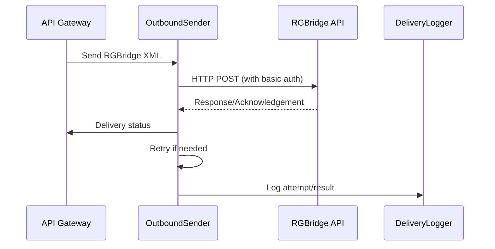

# Technical Design Document: Outbound Delivery

## 1. Purpose & Responsibilities
- Deliver translated RGBridge messages to the internal RGBridge API endpoint via HTTP POST.
- Handle authentication (basic auth) for outbound requests.
- Implement retry logic, error handling, and acknowledgement processing.
- Log all outbound delivery attempts and results for audit and monitoring.

## 2. Key Classes, Modules, or Services
- `OutboundSender` (handles HTTP POST to RGBridge API)
- `RetryHandler` (manages retry logic and backoff)
- `AckProcessor` (processes acknowledgements and responses)
- `DeliveryLogger` (logs all delivery attempts and results)

## 3. Interfaces & APIs
- **Outbound Delivery Function:**
  - `send_rgbridge_message(xml_payload, endpoint_url, auth) -> response, status`
- **Retry Logic:**
  - Configurable max retries, backoff strategy, and error thresholds
- **Acknowledgement Handling:**
  - Parse and process response from RGBridge API
  - Update delivery status (success, failure, retry)

## 4. Data Flow & Interactions
1. API Gateway or Plugin invokes `OutboundSender` with the RGBridge XML payload.
2. `OutboundSender` sends HTTP POST to the configured RGBridge API endpoint with basic authentication.
3. If delivery fails, `RetryHandler` manages retries according to policy.
4. `AckProcessor` parses the response and updates status.
5. All attempts and results are logged by `DeliveryLogger`.



## 5. Extensibility & Configuration
- Endpoint URL, authentication, and retry policy are configurable via environment variables or config files.
- Support for additional outbound protocols (e.g., SOAP, gRPC) can be added via pluggable senders.
- Delivery logging format and retention are configurable.

## 6. Security & Compliance
- Outbound requests use HTTPS and basic authentication.
- Credentials are securely stored and rotated.
- All delivery attempts and responses are logged for audit.
- Sensitive data is masked in logs.
- Complies with GDPR/PCI for data handling and retention.

## 7. Dependencies & Libraries
- `httpx` or `requests` (HTTP client)
- `tenacity` (retry logic)
- `logging` or `structlog` (logging)

## 8. Error Handling & Monitoring
- All delivery errors are logged with context and tracebacks.
- Retries are managed with exponential backoff.
- Alerts can be configured for repeated failures or delivery delays.
- Delivery status is available for monitoring and reporting.

## 9. Example Code or Pseudocode
```python
import httpx
from tenacity import retry, stop_after_attempt, wait_exponential

@retry(stop=stop_after_attempt(3), wait=wait_exponential(multiplier=2))
def send_rgbridge_message(xml_payload, endpoint_url, auth):
    headers = {"Content-Type": "application/xml"}
    response = httpx.post(endpoint_url, data=xml_payload, headers=headers, auth=auth, timeout=10)
    response.raise_for_status()
    return response, response.status_code
```

## 10. Open Questions & Risks
- How to handle partial failures or timeouts from RGBridge API?
- Should there be a dead-letter queue for undeliverable messages?
- What is the expected volume and throughput for outbound delivery?
- How to ensure idempotency and avoid duplicate deliveries?

--- 