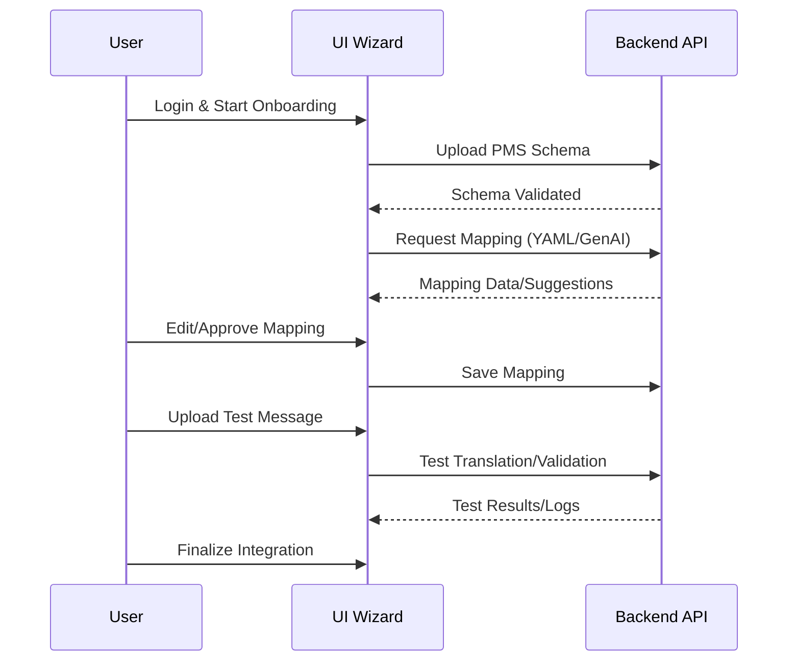

# Technical Design Document: Professional UI Wizard

## 1. Purpose & Responsibilities
- Provide an intuitive, step-by-step onboarding experience for integrating new PMS systems.
- Allow users to upload PMS schemas, review and edit mappings, and test integrations.
- Present GenAI mapping suggestions and enable manual override.
- Display validation results, logs, and integration status.
- Support role-based access control (admin, engineer, vendor, etc.).

## 2. Key Classes, Modules, or Services
- `OnboardingWizard` (multi-step UI for PMS integration)
- `MappingEditor` (visual editor for reviewing and editing mappings)
- `TestInterface` (UI for uploading sample messages and viewing results)
- `AuthModule` (handles user authentication and roles)
- `LogsViewer` (displays logs and validation results)
- `APIClient` (handles communication with backend APIs)

## 3. Interfaces & APIs
- **Frontend-Backend API Endpoints:**
  - `POST /ui/upload-schema` (upload PMS schema)
  - `GET/POST /ui/mapping` (fetch/save mapping YAML)
  - `POST /ui/genai-suggest` (trigger GenAI mapping suggestion)
  - `POST /ui/test` (submit sample message for test run)
  - `GET /ui/logs` (fetch logs and validation results)
  - Auth endpoints: login, logout, user info
- **UI Components:**
  - Stepper/wizard, mapping table/editor, test result panel, log viewer, user menu

## 4. Data Flow & Interactions
1. User logs in and starts the onboarding wizard.
2. User uploads PMS schema; backend validates and stores it.
3. UI fetches initial mapping (from YAML or GenAI suggestion).
4. User reviews/edits mapping in MappingEditor.
5. User uploads sample PMS message for test; UI displays validation and translation results.
6. User finalizes and saves mapping; integration is activated.
7. Logs and status are available throughout the process.



## 5. Extensibility & Configuration
- New onboarding steps or mapping types can be added via modular UI components.
- API endpoints and UI features are configurable via environment variables or settings.
- UI supports internationalization (i18n) and theming.

## 6. Security & Compliance
- User authentication and role-based access enforced throughout UI.
- Sensitive data is masked in UI and logs.
- All user actions are logged for audit.
- Complies with GDPR/PCI for data handling and privacy.

## 7. Dependencies & Libraries
- `React` (frontend framework)
- `Material-UI` or `Ant Design` (UI components)
- `axios` or `fetch` (API calls)
- `redux` or `context` (state management)
- `i18next` (internationalization)
- `jwt-decode` (auth token handling)

## 8. Error Handling & Monitoring
- UI displays clear error messages and validation feedback.
- All API errors are logged and surfaced to users/admins.
- Monitoring tools (e.g., Sentry) can be integrated for error tracking.

## 9. Example Code or Pseudocode
```jsx
// OnboardingWizard.jsx
import React, { useState } from 'react';
import Stepper from '@mui/material/Stepper';
// ... other imports ...

function OnboardingWizard() {
  const [step, setStep] = useState(0);
  // ... state for schema, mapping, test results ...
  return (
    <Stepper activeStep={step}>
      {/* Steps: Upload Schema, Review Mapping, Test, Finalize */}
    </Stepper>
    // ...step content...
  );
}
```

## 10. Open Questions & Risks
- What are the required user roles and permissions?
- Should the UI support multi-user collaboration on the same integration?
- How to handle large or complex mappings in the editor?
- What is the process for UI/UX review and feedback?

--- 