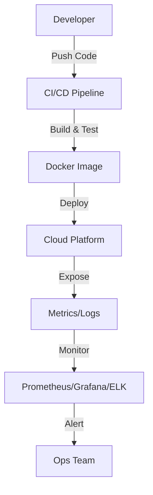

# Technical Design Document: Infrastructure (Docker, CI/CD, Monitoring)

## 1. Purpose & Responsibilities
- Provide a robust, scalable, and secure environment for deploying and running the PMS-to-RGBridge Integration Platform.
- Automate build, test, and deployment processes using CI/CD pipelines.
- Enable monitoring, logging, and alerting for all system components.
- Ensure compliance with security and regulatory requirements (GDPR, PCI).

## 2. Key Classes, Modules, or Services
- `Dockerfile` (containerizes backend, frontend, and plugin system)
- `docker-compose.yml` (or Helm charts for orchestration)
- CI/CD Pipeline (GitHub Actions, GitLab CI, or similar)
- Monitoring Stack (Prometheus, Grafana, Alertmanager)
- Logging Stack (ELK/EFK, or cloud-native logging)
- Secrets Management (Vault, AWS Secrets Manager, etc.)

## 3. Interfaces & APIs
- **CI/CD Pipeline:**
  - Triggers on code push, PR, or tag
  - Stages: lint, test, build, security scan, deploy
- **Monitoring & Logging:**
  - Metrics endpoints (`/metrics`), health checks (`/health`)
  - Log aggregation and search UI
  - Alerting rules and notification channels
- **Secrets Management:**
  - API for fetching secrets at runtime
  - Integration with deployment pipeline

## 4. Data Flow & Interactions
1. Developer pushes code to repository; CI/CD pipeline is triggered.
2. Pipeline lints, tests, builds Docker images, and runs security scans.
3. On success, images are pushed to registry and deployed to cloud (ECS, AKS, GKE, etc.).
4. Running containers expose metrics and logs to monitoring/logging stack.
5. Alerts are sent to ops team on failures or threshold breaches.



## 5. Extensibility & Configuration
- Support for multiple environments (dev, staging, prod) via config files and environment variables.
- Pluggable monitoring and logging backends.
- Secrets and credentials managed per environment.
- Auto-scaling and rolling updates supported by orchestration platform.

## 6. Security & Compliance
- All secrets and credentials are encrypted and never stored in code.
- Images are scanned for vulnerabilities before deployment.
- Network policies restrict access between components.
- Audit logs are retained per compliance requirements.
- Regular backups and disaster recovery plans in place.

## 7. Dependencies & Libraries
- `Docker`, `docker-compose`, or `Kubernetes`
- CI/CD: `GitHub Actions`, `GitLab CI`, or similar
- Monitoring: `Prometheus`, `Grafana`, `Alertmanager`
- Logging: `ELK`/`EFK` stack or cloud-native solutions
- Secrets: `Vault`, `AWS Secrets Manager`, etc.

## 8. Error Handling & Monitoring
- CI/CD pipeline fails on lint/test/build errors; notifications sent to team.
- Monitoring stack alerts on service downtime, high error rates, or resource exhaustion.
- Log aggregation enables rapid troubleshooting and root cause analysis.

## 9. Example Code or Pseudocode
```yaml
# .github/workflows/ci-cd.yml
name: CI/CD Pipeline
on: [push, pull_request]
jobs:
  build:
    runs-on: ubuntu-latest
    steps:
      - uses: actions/checkout@v2
      - name: Set up Python
        uses: actions/setup-python@v2
        with:
          python-version: '3.10'
      - name: Install dependencies
        run: pip install -r requirements.txt
      - name: Lint
        run: flake8 .
      - name: Test
        run: pytest
      - name: Build Docker image
        run: docker build -t myapp:${{ github.sha }} .
      - name: Push to registry
        run: docker push myapp:${{ github.sha }}
```

## 10. Open Questions & Risks
- Which cloud provider(s) and orchestration platform will be used?
- What are the SLAs for uptime, recovery, and alert response?
- How to handle zero-downtime deployments and rollbacks?
- What is the process for rotating secrets and credentials?

--- 