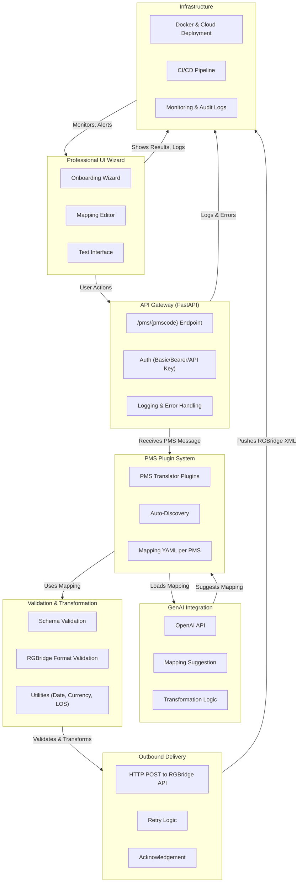

# High-Level Architecture Diagram

```mermaid
flowchart TD
    subgraph UI["Professional UI Wizard"]
        A1["Onboarding Wizard"]
        A2["Mapping Editor"]
        A3["Test Interface"]
    end

    subgraph API_Gateway["API Gateway (FastAPI)"]
        B1["/pms/{pmscode} Endpoint"]
        B2["Auth (Basic/Bearer/API Key)"]
        B3["Logging & Error Handling"]
    end

    subgraph PluginSystem["PMS Plugin System"]
        C1["PMS Translator Plugins"]
        C2["Auto-Discovery"]
        C3["Mapping YAML per PMS"]
    end

    subgraph GenAI["GenAI Integration"]
        D1["OpenAI API"]
        D2["Mapping Suggestion"]
        D3["Transformation Logic"]
    end

    subgraph Validation["Validation & Transformation"]
        E1["Schema Validation"]
        E2["RGBridge Format Validation"]
        E3["Utilities (Date, Currency, LOS)"]
    end

    subgraph Outbound["Outbound Delivery"]
        F1["HTTP POST to RGBridge API"]
        F2["Retry Logic"]
        F3["Acknowledgement"]
    end

    subgraph Infra["Infrastructure"]
        G1["Docker & Cloud Deployment"]
        G2["CI/CD Pipeline"]
        G3["Monitoring & Audit Logs"]
    end

    %% Data Flow
    UI -->|"User Actions"| API_Gateway
    API_Gateway -->|"Receives PMS Message"| PluginSystem
    PluginSystem -->|"Loads Mapping"| GenAI
    PluginSystem -->|"Uses Mapping"| Validation
    GenAI -->|"Suggests Mapping"| PluginSystem
    Validation -->|"Validates & Transforms"| Outbound
    Outbound -->|"Pushes RGBridge XML"| Infra
    API_Gateway -->|"Logs & Errors"| Infra
    UI -->|"Shows Results, Logs"| Infra
    Infra -->|"Monitors, Alerts"| UI
``` 