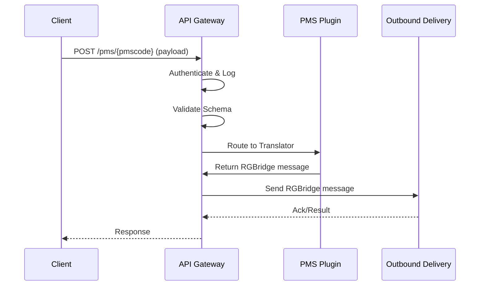

# Technical Design Document: API Gateway

## 1. Purpose & Responsibilities
- Serve as the main entry point for all incoming PMS messages.
- Route requests to the appropriate PMS translator plugin based on the PMS code in the URL.
- Handle authentication, logging, error handling, and request validation.
- Expose RESTful endpoints for PMS integration and internal monitoring.

## 2. Key Classes, Modules, or Services
- `main.py` (FastAPI app entry point)
- `PMSRouter` (dynamic route handler for `/pms/{pmscode}`)
- `AuthMiddleware` (handles API key, basic, or bearer authentication)
- `RequestLogger` (logs requests and responses)
- `ErrorHandler` (centralized error handling)
- `SchemaValidator` (validates incoming payloads)

## 3. Interfaces & APIs
- **Endpoint:** `POST /pms/{pmscode}`
  - Accepts: JSON, XML, GraphQL, or SOAP payloads
  - Headers: Content-Type, Authorization
  - Auth: API key, basic, or bearer token
  - Response: 200 OK (success), 400/422 (validation error), 401 (unauthorized), 500 (internal error)
- **Monitoring Endpoints:**
  - `GET /health` (health check)
  - `GET /metrics` (for Prometheus or similar)

## 4. Data Flow & Interactions
1. Incoming request hits `/pms/{pmscode}` endpoint.
2. AuthMiddleware validates credentials.
3. RequestLogger logs the request.
4. SchemaValidator validates the payload against the PMS schema.
5. PMSRouter loads the appropriate translator plugin.
6. Translated message is passed to downstream components (validation, outbound delivery).
7. Response is returned to the client; errors are handled by ErrorHandler.



## 5. Extensibility & Configuration
- New PMS integrations require only a new plugin and mapping file; no changes to API Gateway code.
- Authentication methods configurable via environment variables.
- Logging and monitoring endpoints can be enabled/disabled via config.

## 6. Security & Compliance
- Supports API key, basic, or bearer authentication.
- Logs all access and errors for audit purposes.
- Sanitizes sensitive data in logs.
- Enforces HTTPS in production.
- Complies with GDPR and PCI for data handling and retention.

## 7. Dependencies & Libraries
- FastAPI (web framework)
- Pydantic (request validation)
- Uvicorn (ASGI server)
- python-xmlschema, graphql-core (for schema validation)
- Logging (standard or structlog)
- Prometheus client (for metrics)

## 8. Error Handling & Monitoring
- Centralized error handler returns consistent error responses.
- All errors and exceptions are logged with tracebacks.
- Health and metrics endpoints for monitoring.
- Alerts can be configured for repeated failures or downtime.

## 9. Example Code or Pseudocode
```python
from fastapi import FastAPI, Request, Depends
from .auth import AuthMiddleware
from .plugins import get_translator
from .validation import validate_schema

app = FastAPI()

@app.post("/pms/{pmscode}")
async def receive_pms_message(pmscode: str, request: Request, user=Depends(AuthMiddleware)):
    payload = await request.body()
    validate_schema(pmscode, payload)
    translator = get_translator(pmscode)
    rgbridge_msg = translator.translate(payload)
    # ... send to outbound delivery ...
    return {"status": "success"}
```

## 10. Open Questions & Risks
- How to handle versioning of PMS schemas and plugins?
- Should rate limiting or IP whitelisting be enforced?
- What is the expected peak load and scaling strategy?
- How to support hot-reloading of plugins without downtime?

--- 