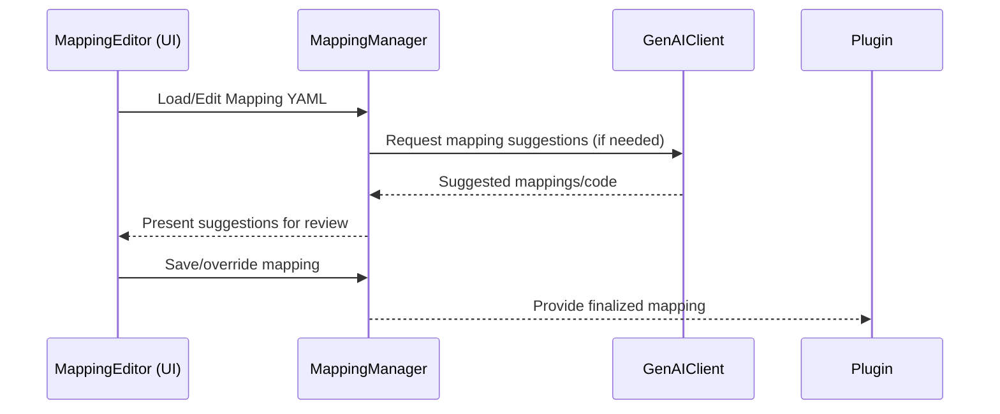

# Technical Design Document: Mapping Knowledge Base & GenAI Integration

## 1. Purpose & Responsibilities
- Maintain a static, auditable mapping knowledge base (YAML) for each PMS.
- Provide mapping between PMS message fields and RGBridge format fields.
- Integrate with GenAI (OpenAI API) to suggest, generate, and refine mappings and transformation logic.
- Support manual review and override of mappings via UI.

## 2. Key Classes, Modules, or Services
- `MappingManager` (loads, validates, and manages mapping YAML files)
- `GenAIClient` (handles calls to OpenAI API for mapping suggestions and code generation)
- `MappingValidator` (ensures mapping files conform to schema and business rules)
- `MappingEditor` (UI/editor integration for mapping review and override)

## 3. Interfaces & APIs
- **Mapping File Format:**
  - YAML structure with PMS-to-RGBridge field mappings, transformation rules, and metadata.
- **GenAI API Integration:**
  - REST calls to OpenAI API for mapping suggestions and transformation logic.
  - Input: PMS schema, sample messages, existing mappings.
  - Output: Suggested mappings, code snippets, transformation rules.
- **Mapping Management API (optional):**
  - CRUD operations for mappings (admin use)
  - Endpoint to trigger GenAI mapping suggestion

## 4. Data Flow & Interactions
1. On PMS onboarding, MappingManager loads or creates a mapping YAML file.
2. If mappings are incomplete or unclear, GenAIClient queries OpenAI API for suggestions.
3. MappingEditor (UI) presents mappings and suggestions for manual review/override.
4. Finalized mappings are saved and used by the PMS Plugin for translation.



## 5. Extensibility & Configuration
- New PMS: add a new mapping YAML file under `/pms/{pmscode}/mappings.yaml`.
- GenAI integration can be enabled/disabled via config.
- Mapping schema and validation rules are configurable.

## 6. Security & Compliance
- Mapping files are version-controlled and auditable.
- Sensitive data is masked in logs and UI.
- GenAI API keys are securely stored and rotated.
- All mapping changes are logged for audit purposes.
- Compliance with GDPR/PCI for data handling and retention.

## 7. Dependencies & Libraries
- `PyYAML` (YAML parsing)
- `pydantic` (schema validation)
- `openai` (OpenAI API client)
- `requests` or `httpx` (HTTP calls)

## 8. Error Handling & Monitoring
- Mapping load/validation errors are logged and surfaced in UI.
- GenAI API errors are handled gracefully with user feedback.
- All mapping changes and GenAI calls are logged for traceability.

## 9. Example Code or Pseudocode
```python
# mapping_manager.py
import yaml
from pydantic import BaseModel

class MappingManager:
    def load_mapping(self, pmscode):
        with open(f"pms/{pmscode}/mappings.yaml") as f:
            return yaml.safe_load(f)
    def save_mapping(self, pmscode, mapping):
        with open(f"pms/{pmscode}/mappings.yaml", "w") as f:
            yaml.safe_dump(mapping, f)

# genai_client.py
import openai

def suggest_mapping(pms_schema, rgbridge_schema):
    prompt = f"Map the following PMS schema to RGBridge: ..."
    response = openai.ChatCompletion.create(...)
    return response['choices'][0]['message']['content']
```

## 10. Open Questions & Risks
- How to handle conflicting or ambiguous mapping suggestions from GenAI?
- What is the process for manual override and approval of mappings?
- How to ensure mapping changes are properly versioned and auditable?
- What are the rate limits and costs for GenAI API usage?

--- 